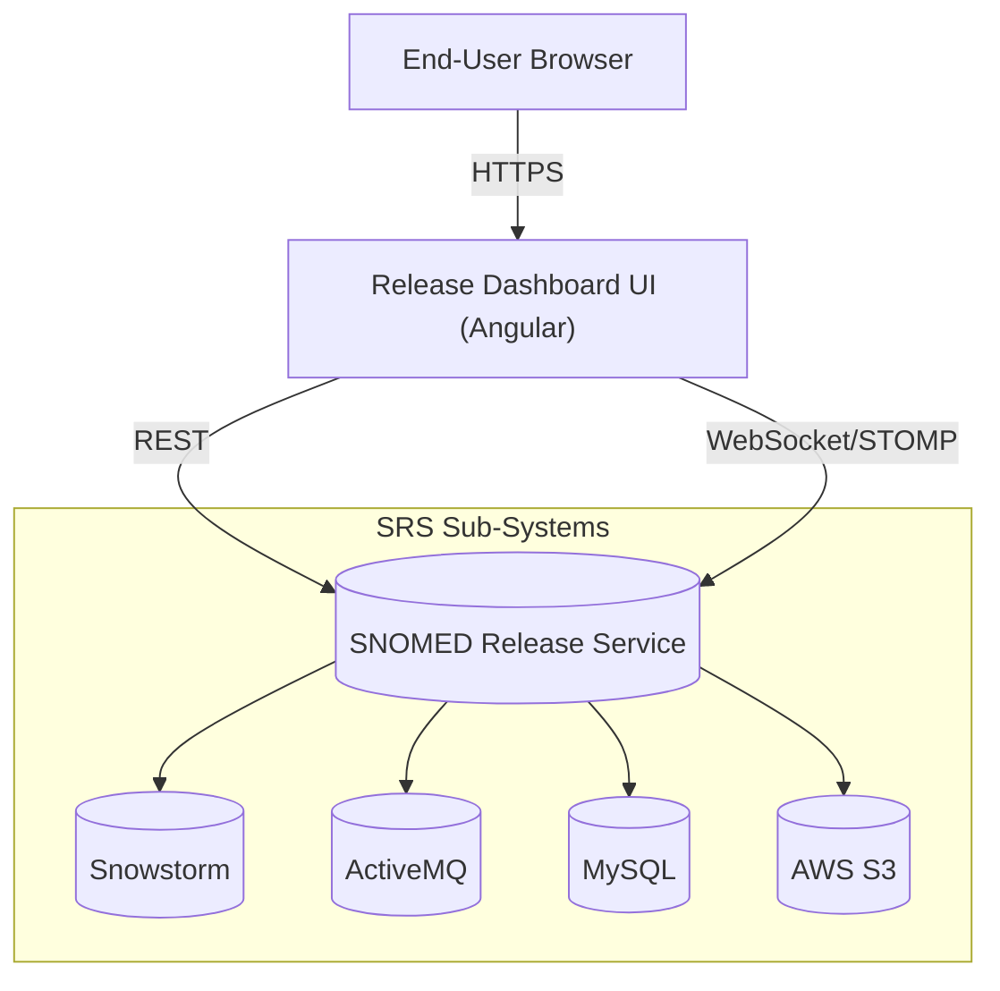
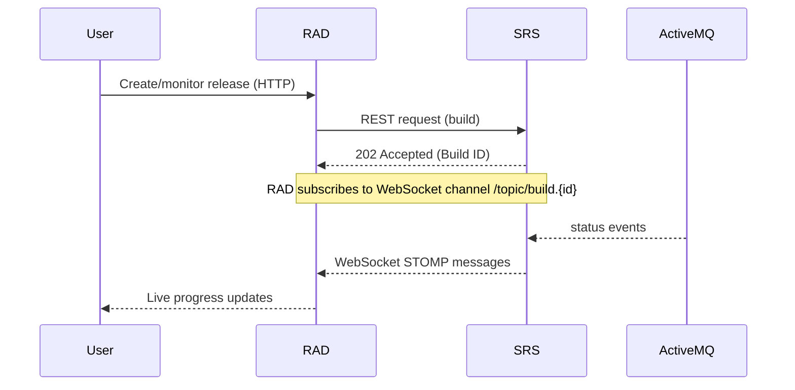

# SNOMED Release Dashboard UI

The **SNOMED Release Dashboard UI** is an Angular-based web application that provides a real-time window into the **SNOMED CT Release Service (SRS)** ecosystem.  It allows Product Support, Release Managers and Automations to **create, monitor and manage SNOMED CT release packages** while surfacing build telemetry and notifications in a single place.  

RAD consumes the SRS **REST & WebSocket API** and complements it with an intuitive, Material-styled front-end that can be deployed either as a **Server-Side Rendered (SSR) Node application** or as a static single-page application (SPA).

This document explains **how to run the Release Dashboard locally** and the **engineering best-practices** expected when contributing to the code-base.

---

## 1  High-Level Architecture



<br/>

#### Typical Release Monitoring Workflow



Key points:
* **Stateless** – The UI stores no session state; authentication context is provided by the SRS security layer.
* **Angular Universal** powers SSR for SEO-friendly production deployments while preserving SPA behaviour for local dev.
* **WebSocket/STOMP** streams build notifications to the UI in real-time.
* **Maven + jdeb** pipeline packages the compiled artefacts into a Debian **.deb** for Linux deployment under `supervisord`.

---

## 2  Feature Highlights

* **Angular 19 + Stand-alone Components** – modern, tree-shakable architecture with signal-based change-detection.
* **Material Design & Bootstrap** – rich, responsive component library.
* **SSO-secured HTTP interceptor** – transparently adds bearer tokens provided by the SRS auth service.
* **Real-time Build Dashboard** – [`WebsocketService`](./src/app/services/websocket/websocket.service.ts) receives STOMP messages and pushes toast / table updates.
* **Release-Package CRUD** – [`ReleaseServerService`](./src/app/services/releaseServer/release-server.service.ts) exposes high-level methods for creating, cloning and deleting builds.
* **Environment-aware favicons & banners** – visual cues for `local`, `dev`, `uat`, `training` & `prod` environments.
* **End-to-End tests with Cypress** – headless or interactive mode supported, HTML reports via Mochawesome.
* **Debian Packaging** – [`pom.xml`](./pom.xml) leverages `frontend-maven-plugin` & `jdeb` to ship `/opt/release-dashboard-ui` packages.

---

## 3  Project Layout

```
/                             ← project root
 ├─ src/
 │  ├─ app/                   ← Angular components, services, routes, etc.
 │  ├─ assets/                ← images, styles, i18n JSON, …
 │  ├─ environments/          ← `environment*.ts` build-time configs
 │  └─ styles.scss            ← global SCSS imports
 ├─ cypress/                  ← E2E spec & support files
 ├─ deb/                      ← Debian control files
 ├─ server.ts                 ← Express SSR entry-point
 ├─ angular.json              ← Angular CLI workspace configuration
 ├─ package.json              ← npm scripts & dependencies
 └─ pom.xml                   ← Maven build & packaging
```

Package conventions inside `src/app`:
* `components`        Re-usable dumb UI widgets and layout shells.
* `services`          REST/WebSocket abstraction layers.
* `interceptors`      HTTP interceptors for auth & headers.
* `models`            TypeScript interfaces & enums shared across the app.
* `pipes`, `directive` Angular utility pipes/directives.

---

## 4  Getting Started Locally

### 4.1  Prerequisites

1. **Node.js ^22.7.0** (managed by `nvm`, `asdf`, or brew)
2. **npm ^10.8.2** (bundled with Node)
3. **Angular CLI 19** – `npm i -g @angular/cli@19`
4. (Optional) **Java 17 + Maven 3.8** if you plan to run the Debian packaging pipeline.
5. A running **SRS backend** on `http://localhost:8081/api` (or update environment).

> **Tip:** Use the [`docker-compose`](https://github.com/IHTSDO/snomed-release-service) script in the SRS repo to spin up the full stack.

### 4.2  Clone & Install

```bash
$ git clone https://github.com/IHTSDO/release-dashboard-ui.git
$ cd release-dashboard-ui
$ npm ci            # deterministic install
```

### 4.3  Development Server (SPA)

```bash
$ npm start         # alias for "ng serve"
```

Open <http://localhost:4200/>.  The app will automatically reload if you change any source file.

### 4.4  Running with SSR locally

```bash
# 1. Build browser & server bundles
$ npm run build:prod

# 2. Start the Node server (Express + Angular Universal)
$ node dist/release-dashboard-ui/server/server.mjs   # OR ts-node server.ts
```

Navigate to <http://localhost:4000/> to view the pre-rendered version.

### 4.5  Configuration

Runtime environment is inferred from `window.location.host` and can be overridden via the following **build-time** files:

* `src/environments/environment.ts` – dev defaults
* `src/environments/environment.prod.ts` – prod overrides

Key properties:
```ts
export const environment = {
  production: false,
  apiUrl: 'http://localhost:8081/api',
  websocketUrl: 'ws://localhost:8081/api/websocket'
};
```

For **Docker/Kubernetes** deployments you can overwrite the values by serving a `/assets/env.js` file (see `EnvService`).

---

## 5  Testing & Quality Gates

* **End-to-End** – `npx cypress run` generates Mochawesome reports under `cypress/reports/`.
* **Linting** – `npm run lint` executes Angular ESLint rules; commit hooks via Husky are recommended.
* **SonarQube** – `sonarqube-scanner` script available for CI pipelines.

---

## 6  Deployment

### 6.1  Static SPA (CDN / S3 / Nginx)

```bash
$ npm run build:prod
# Upload contents of dist/release-dashboard-ui/browser to your web server or CDN.
```

### 6.2  SSR Node Service

Package the UI and install the `.deb` on a Debian/Ubuntu host:

```bash
$ mvn -Pdeb package        # Produces target/release-dashboard-ui-${VERSION}-all.deb
$ sudo dpkg -i target/release-dashboard-ui-*.deb
$ sudo systemctl restart supervisor   # if managed by supervisord
```

The package installs under `/opt/release-dashboard-ui/` and logs to `/var/log/release-dashboard-ui/`.

---
